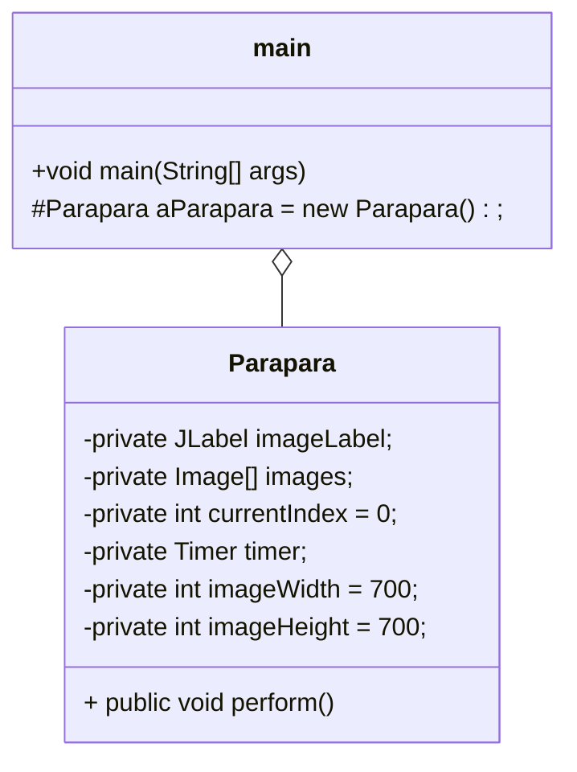

# Parapara

```mermaid

classDiagram

  direction TB

  class main{
    +void main(String[] args)
    #Parapara aParapara = new Parapara();
  }

  class  Parapara{
    + public void perform() 
    -private JLabel imageLabel;
    -private Image[] images;
    -private int currentIndex = 0;
    -private Timer timer;
    -private int imageWidth = 700;
    -private int imageHeight = 700;
  }


  main o-- Parapara


```

