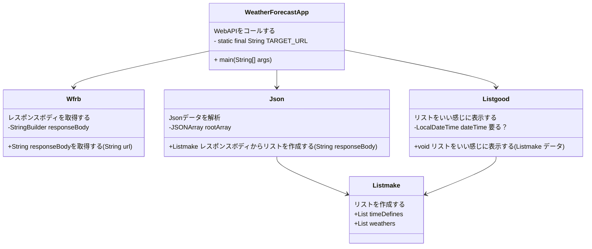

# WeatherForecastApp

```mermaid
classDiagram
    class WeatherForecastApp {
        WebAPIをコールする 
        - static final String TARGET_URL
        + main(String[] args)
        
    }
    class Wfrb{
        レスポンスボディを取得する
        -StringBuilder responseBody
        +String responseBodyを取得する(String url)
        
    }
    class Listmake{
        リストを作成する
        +List<String> timeDefines
        +List<String> weathers
    }
    class Listgood{
        リストをいい感じに表示する
        -LocalDateTime dateTime 要る？
        +void リストをいい感じに表示する(Listmake データ)

    }
    class Json{
        Jsonデータを解析
        -JSONArray rootArray
        +Listmake レスポンスボディからリストを作成する(String responseBody)

    }
    WeatherForecastApp--> Wfrb
    WeatherForecastApp--> Json
    WeatherForecastApp-->Listgood
    Json-->Listmake
    Listgood-->Listmake
    


```